# Hey What's up ?

### 
I'm Kartik Sable ,an aspiring Cloud Engineer currently learning and building hands-on projects.

⚡ Built on caffeine, curiosity, and clean commits.  

🧠 From Python → Cloud → DevOps (future-focused learning path)  

🌩️ Turning ideas into scalable systems  

💭 Fun fact: I use tabs over spaces  

🌱 Currently learning DevOps & Cloud  

---

# 🚀 Tech Stack  

---

# ☁️ Cloud & DevOps (Currently Learning)  

---

# 🧩 Additional Tools  

---

# 🔗 Connect with me  

---

# 📊 GitHub Stats  

  

  

<picture>
  <source media="(prefers-color-scheme: dark)" srcset="https://raw.githubusercontent.com/tobiasmeyhoefer/tobiasmeyhoefer/output/github-snake-dark.svg" />
  <source media="(prefers-color-scheme: light)" srcset="https://raw.githubusercontent.com/tobiasmeyhoefer/tobiasmeyhoefer/output/github-snake.svg" />
  
</picture>

